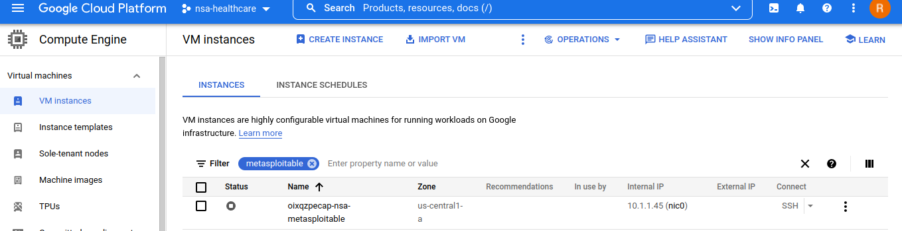

# Enabling Nested Virtualization 
Nested virtualization is a feature that allows VM instances to run their own virtual machines. For instance, if we need to connect to metasploitable without exposing it to the network, this method is recommended. 

## Walkthrough
For this example, a new metasploitable workout has been built. This workout is an Ubuntu server that runs Metasploitable 3 within it. 

To start, click the cloud shell terminal at the top right next to the bell icon.



Once the shell opens up at the bottom, we're going to check the settings of the VM just made.

```
gcloud compute instances export VM_NAME --destination=YAML_FILE_PATH --zone=ZONE
```
Replace VM_NAME, YAML_FILE_PATH, and ZONE. So for this example it would be:
```
gcloud compute instances export oixqzpecap-nsa-metasploitable --destination=oixqzpecap-nsa-metasploitable.yaml --zone=us-central1-a
```
It may have a popup that asks you to authorize gcloud commands. Click authorize and it should export the settings to that yaml.

Now to view it, use a text editor like nano or vim. Try to find the following:
```
advancedMachineFeatures:
  enableNestedVirtualization: true
```
If it doesn't exist, type it out at the top or bottom of the file. Save your changes.

Now, we will update the settings using the following command:
```
gcloud compute instances update-from-file VM_NAME --source=FILE_PATH --most-disruptive-allowed-action=RESTART --zone=ZONE
```

So for this example it would be:
```
gcloud compute instances update-from-file oixqzpecap-nsa-metasploitable --source=oixqzpecap-nsa-metasploitable.yaml --most-disruptive-allowed-action=RESTART --zone=us-central1-a
```
To confirm, connect to the VM instance using ssh like so:
```
gcloud compute ssh VM_NAME
```
You can also just connect to it directly through the GCP.

Type in the following command once connected:
```
grep -cw vmx /proc/cpuinfo
```
If the output is a number other than 0, then that means nested virtualization is now enabled!