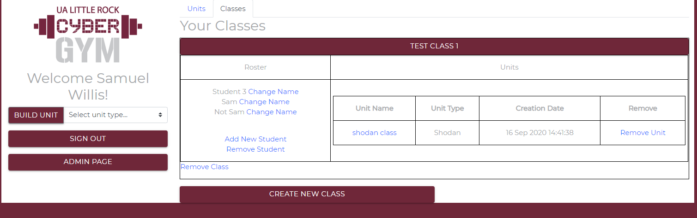
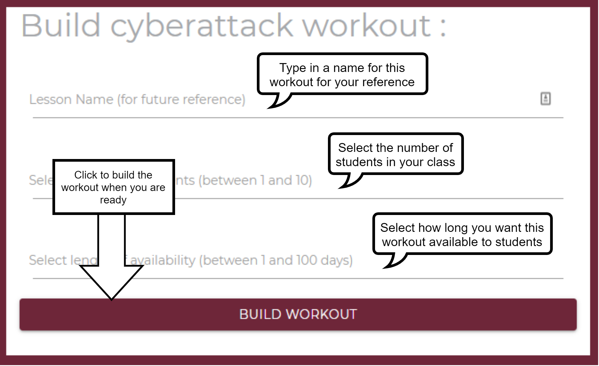

# Instructor Guide

## Logging In
**First Login**
To log in to the cybergym, navigate to <cybergym_domain>/login where you will be asked to log in with a Google account. When attempting to access instructor resources for the first time, you will encounter a page saying that you are unauthorized. This will persist until a cybergym administrator manually approves your account.

## Teacher Home Page
**Unit List**

The default view of the teacher home page shows a list of all the units tied to your account, organized by workout type. Clicking on a workout type will open a table providing the links to each of the corresponding unit landing pages, as well as the date each unit was created. 

 - A **Unit** is simply a collection of workouts of a particular type (for example, a set of 10 Cyberattack workouts). You may have several units of each type depending on course load. 

**Class List**

The second tab on the top of the screen is the class list. In this menu, you can create and edit classes with persistent rosters to make creating and managing groups of students much easier. To create a class, click on the class tab and click the "Create New Class" button. This will a reveal a form that simply asks for the name of the class and the number of students. Upon submission, the class roster will be auto-populated with students. You have the ability to change each individual student name, add a new student, and remove students. Each student must have a unique name, as the add/delete operations are case-sensitive. Changing a student name will also retroactively change the name for all previous workouts registered to that student.

**Build Options**
On the left side of the screen, you will see a dropdown menu with a build button. By selecting an option in the dropdown and clicking the build button, you will automatically be redirected to the appropriate page to begin building your unit.

## Building a Workout or Arena

You as an instructor have access to build specified workouts and arenas. The links to build the workouts should be provided or developed by you. A workout or arena is simply a document specifying how to build each lab environment in the cloud. 

If you have already registered a class through the teacher home page, you can select the appropriate checkbox to build the workout to a class. This will reveal a dropdown menu with all of your classes. Selecting a class will register each workout to a student in that class, and the unit will be visible from the class management tab in the teacher home page.

The form simply accepts the number of students in your course the length of time you want to keep the workout or arena available. When you click to build, all of the information necessary to build labs for each of your students is packaged and kicked off. In a few seconds, you will be directed to your instructor management page for the requested build. However, keep in mind, the build will take several minutes to complete. It may take up to 15 minutes for everything to be ready for the students.

**What is the difference between a workout and an arena?** A workout means each student has their own isolated network, whereas arenas allow all students to reside in the same network.

## Managing Each Workout or Arena

Soon after building a workout or arena, the application will direct you to a page with all of the requested workouts as shown below. Although the student labs are allocated very quickly, it may still take 10-20 minutes for the actual cloud resources to build. You can still send these links out to the students in the meantime.

For workouts or arenas having teacher instructions, you can access that through the link provided as shown above.

Click on each student entry to see their workout information. Here you can perform the following functions:

1.  **Landing Page** - This will be a link made specifically for each student. Hover over _Landing Page_ to obtain the custom link, and copy and paste that into an email for the student.

2.  **Assessment** - Some workouts and arenas come with built-in assessments. For these, students will go through their instructions and submit their assessments. You can see the results of the assessment in this listing.

3.  **Change Student Name -** For your convenience, you may change the student’s name to make the workouts or arenas easier to track.