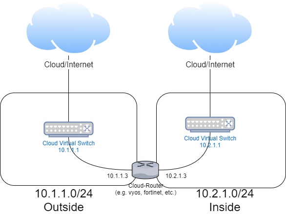

# Routing in the Cyber Arena
A few workouts have multiple networks per workout for allowing students to develop network security skills.
As of this writing, we use both the vyos open-source router, and a virtual Fortinet appliance. However, they both
have the similar configuration for cloud routing. The main difference when working with virtual routers in the cloud
is understanding the cloud virtual switch they run through as shown in the following figure.



The router needs static routes with the next hop as the gateway virtual switch address. So, in the diagram, the following
static routes would be necessary to configure on the router (commands in vyos):
1. static route 10.1.1.0/24 next-hop 10.1.1.1
2. static route 10.2.1.0/24 next-hop 10.2.1.1
3. static route 10.1.1.3/32 next-hop-interface eth0
4. static route 10.2.1.3/32 next-hop-interface eth1

The interfaces themselves should have a single IP subnet. So, for eth0, the address would be 10.1.1.3/32 (as opposed 
to 10.1.1.3/24).

Finally, the cloud configuration also needs to include routes from its virtual switches. For example, if we wanted the 
10.2.1.0/24 to only go through the 10.1.1.0/24 network, we would specify cloud default routes (commands in Google SDK):
```
gcloud compute routes create cyberarena-external-to-internal --destination-range=10.2.1.0/24 --next-hop-instance=Cloud-Router --network external
gcloud compute routes create cyberarena-internal-to-external --destination-range=0.0.0.0/0 --next-hop-instance=Cloud-Router --network internal
```

