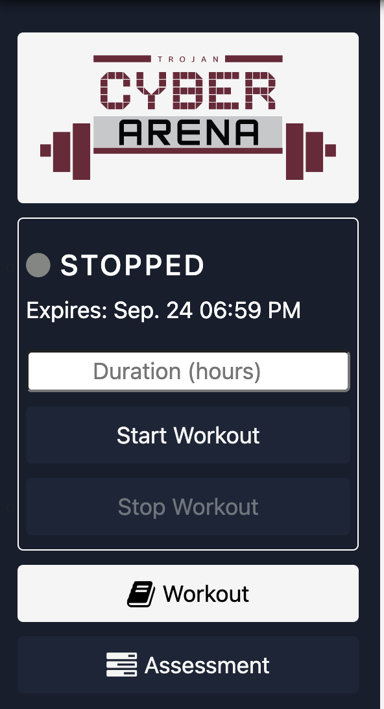

# Lab 1 - Vulnerability Scanning

## Objectives

- Learn how to use a vulnerability scanner
- Learn how to use a vulnerability scanner to find vulnerabilities in a server
- Understand the output of a vulnerability scanner

## Overview

In this lab, you will learn how to use a vulnerability scanner to find vulnerabilities in a server. You will use the vulnerability scanner Nessus to scan a server and find vulnerabilities. You will then analyze the output of the scan to determine what vulnerabilities exist on the server.

## Cyber Arena Server Information

Username: `cybergym`
Password: `Let's workout!`

1. Click on the `Start Workout` button to start the workout.

    
2. Click on the `Connect` button to get instructions on how to connect to the server.

## Lab Instructions

### Part 1 - Uncredentialed Scan

1. Once connected to the workout Server, you may need to be presented with a unexpected shutdown message. If you are just put something into the fileds and click `OK`.
2. Open the web browser found on the Desktop.
3. The web browser should automatically bring you to the Nessus login page. If it does not, go to the URL `https://localhost:8834/`.
4. Login to Nessus using the credentials
   - username: `cybergym`
   - password: `Let's workout!`
5. Click on the `New Scan` button to create a new scan.
6. Click on the `Basic Network Scan` button to create a new scan.
7. Enter the name `Lab 1 Scan` for the scan name.
8. Enter the description `Lab 1 Scan` for the scan description.
9. Click on the `Add` button to add a target to the scan.
10. Enter the IP address `10.1.1.27` for the target.
11. Click on the `Add` button to add the target to the scan.
12. Click on the `Save` button to save the scan.
13. Click on the `Launch` button to launch the scan.
14. Wait for the scan to complete.
    Note: This may take a few minutes, so go get a drink of water or do some pushups.
15. Click on the `Lab 1 Scan` link to view the results of the scan.
16. Click on the `Vulnerabilities` tab to view the vulnerabilities found by the scan.
17. Create a document on your personal computer and list the vulnerabilities found by the scan.

### Part 2 - Credentialed Scan

1. Click on the `New Scan` button to create a new scan.
2. Click on the `Basic Network Scan` button to create a new scan.
3. Enter the name `Credential Scan` for the scan name.
4. Enter the description `Credential Scan` for the scan description.
5. Click on the `Add` button to add a target to the scan.
6. Enter the IP address `10.1.1.27` for the target.
7. Click on the `Add` button to add the target to the scan.
8. Click on the `Credentials` tab.
9. Click on the `Add` button to add credentials to the scan.
   1. Enter the username `cybergym` for the username.
   2. Enter the password `Let's workout!` for the password.
10. Click on the `Save` button to save the scan.
11. Click on the `Launch` button to launch the scan.
12. Wait for the scan to complete.
    Note: This may take a few minutes, so go get a scone or do some squats.
13. Click on the `Credential Scan` link to view the results of the scan.
14. Click on the `Vulnerabilities` tab to view the vulnerabilities found by the scan.
15. In the document you created in Part 1, list the vulnerabilities found by the credentialed scan.

### Part 3 - Analysis

1. Compare the results of the uncredentialed scan to the results of the credentialed scan.
2. Explain why the results of the uncredentialed scan are different from the results of the credentialed scan.
3. Pick two vulnerability found by the credentialed scan and explain how you would fix the vulnerability.
   1. List the vulnerability
   2. Explain what the vulnerability is and how it can be exploited
   3. Explain how you would fix the vulnerability
4. Save your document with the the following naming convention: `lastname_firstname_lab1`
5. Turn in your document to Blackboard.

## Grading Rubric

| Item | Expectation| Points |
|------|--------|-------|
| Did you create a document listing the vulnerabilities found by the uncredentialed scan? | List all vulnerabilities with the criticality level. Document is formatted for clarity |10 |
| Did you create a document listing the vulnerabilities found by the credentialed scan? | List all vulnerabilities with the criticality level. Document is formatted for clarity |10 |
| Did you explain why the results of the uncredentialed scan are different from the results of the credentialed scan? | The explanation was thorough and well thought out. All work was cited |40 |
| Did you pick two vulnerability found by the credentialed scan and explain how you would fix the vulnerability? | Two vulnerabilities were presented. The explanation was thorough and well thought out. All work was cited |40 |
